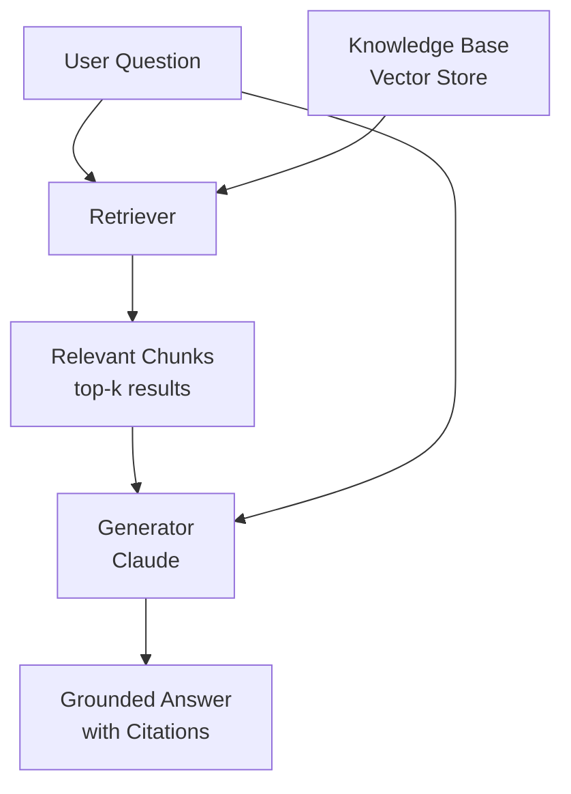

# **Module 3, Lesson 1: Introduction to RAG**

Building on what we've learned about context and prompting, this lesson introduces Retrieval-Augmented Generation — the most impactful technique for building grounded, factual AI applications.

---

## Learning Objectives

By the end of this lesson you will be able to:
- **Define** Retrieval-Augmented Generation (RAG) and explain the problem it solves
- **Explain** the three-component architecture of a RAG system
- **Build** a working RAG pipeline using ChromaDB and Claude ([code/module3/lesson1_rag_pipeline.py](../../code/module3/lesson1_rag_pipeline.py))
- **Apply** RAG to answer questions grounded in your own documents

---

## 1. The Problem: LLMs Don't Know Everything

Imagine giving someone a closed-book exam and then a separate open-book exam. In the closed-book exam they rely purely on memorised knowledge — and may confidently state things that are wrong. In the open-book exam they check the source material before answering.

LLMs are, by default, closed-book. Their knowledge was frozen at training time. They can hallucinate confidently on topics where they were trained on incorrect or outdated data. RAG turns them into open-book test-takers.

**RAG solves two problems:**
1. **Knowledge cutoff** — the model hasn't seen documents published after training
2. **Private data** — company docs, internal wikis, or personal files were never in the training set

---

## 2. RAG Architecture

A RAG system has three components:



| Component | What it does | Tool used in this course |
|---|---|---|
| **Retriever** | Finds the most relevant document chunks for the query | ChromaDB + sentence-transformers |
| **Knowledge Base** | Stores documents as embeddings in a vector store | ChromaDB (local) |
| **Generator** | Reads retrieved chunks and generates a cited answer | Claude |

---

## 3. Two Phases: Index and Query

### Phase 1 — Indexing (done once)

```
Raw Documents → Split into Chunks → Embed each Chunk → Store in ChromaDB
```

1. **Split**: Break documents into chunks (100-500 tokens). See [Module 4](../Module4/) for chunking strategies.
2. **Embed**: Convert each chunk to a vector using `sentence-transformers/all-MiniLM-L6-v2`
3. **Store**: Save vectors + original text + metadata (source, page) in ChromaDB

### Phase 2 — Querying (done per user question)

```
User Query → Embed Query → Search ChromaDB → Top-k Chunks → Claude → Answer
```

1. **Embed the query** using the same model used during indexing
2. **Search**: ChromaDB finds the chunks whose vectors are most similar to the query vector
3. **Generate**: Claude receives the chunks as context and produces a cited answer

---

## 4. What is an Embedding?

An embedding is a list of numbers (a vector) that represents the semantic meaning of text. Similar texts have similar vectors.

For example:
- "How much PTO do I get?" → `[0.12, -0.45, 0.33, ...]`
- "How many vacation days are available?" → `[0.11, -0.44, 0.35, ...]` (close!)
- "What is the GDP of France?" → `[0.89, 0.12, -0.67, ...]` (far away)

ChromaDB measures similarity using L2 distance — a lower distance means more similar.

---

## 5. Key Design Decision: The RAG Prompt

The generator prompt must instruct Claude to:
1. Answer ONLY from the retrieved context
2. Cite which source it used
3. Admit when the context doesn't contain the answer

See the answer key in [solutions/module3/solution_rag_prompt.py](../../solutions/module3/solution_rag_prompt.py).

---

## Key Takeaways

- RAG grounds LLM responses in retrieved documents, reducing hallucination
- The indexing phase (embed + store) runs once; the query phase runs per question
- Good chunking and good retrieval matter as much as the generator prompt
- Always instruct the generator to cite sources and admit uncertainty

---

## Hands-On Task

Run the working RAG pipeline:

```bash
python code/module3/lesson1_rag_pipeline.py
```

Then extend it:

1. Add 3 new documents to the `SAMPLE_DOCUMENTS` list — use a topic you care about
2. Test 5 different queries and observe which documents are retrieved
3. Find a query that retrieves the wrong chunk. What would you do to fix it?

**Design challenge:** Write a complete RAG system prompt for a legal document assistant. It should: (a) cite the exact clause number, (b) use plain English, (c) recommend consulting a human lawyer for complex questions.

See the answer key: [solutions/module3/solution_rag_prompt.py](../../solutions/module3/solution_rag_prompt.py)

---

*Next: [Lesson 2 — Advanced RAG: Metadata Filtering & Hybrid Search](Lesson2_Advanced_RAG.md)*
