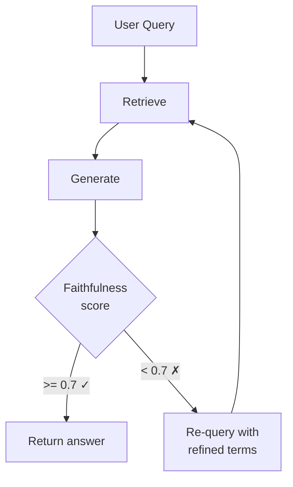
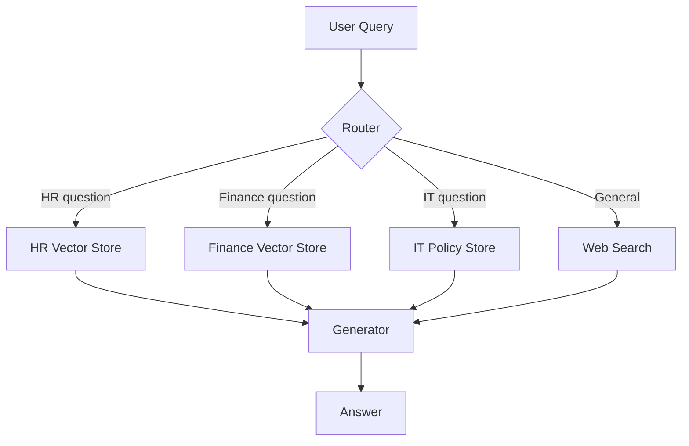

# **Module 3, Lesson 4: Production RAG Patterns**

With a working RAG pipeline and evaluation metrics in place, this lesson covers the architectural patterns used in production systems — corrective RAG, self-RAG, and query routing.

---

## Learning Objectives

- **Define** corrective RAG, self-RAG, and query routing
- **Explain** when each pattern adds value over the basic pipeline
- **Apply** the corrective RAG loop to reduce hallucinations in a live system

---

## 1. Why the Basic Pipeline Isn't Enough

The basic RAG pipeline (retrieve → generate) has two silent failure modes:

1. **Retrieval returns the wrong chunks** — the generator invents an answer from irrelevant context
2. **The query is out of scope** — no relevant chunk exists, but the generator fabricates one anyway

Production systems need feedback loops that catch these failures before the answer reaches the user.

---

## 2. Corrective RAG

After generation, run a faithfulness check. If the score is below a threshold, either retrieve again with a refined query or return a safe fallback.



**Implementation pattern:**

```python
def corrective_rag(query, collection, max_retries=2):
    for attempt in range(max_retries + 1):
        chunks = retrieve(query, collection)
        answer = generate_answer(query, chunks)
        score  = faithfulness_score(answer, chunks)

        if score >= 0.7:
            return answer, score

        # Refine the query for next attempt
        query = refine_query(query, answer)  # Ask LLM to rephrase

    return "I don't have reliable information on this topic.", 0.0
```

**Cost:** One extra evaluation call per generation. Worth it for high-stakes applications (legal, medical, finance).

---

## 3. Self-RAG

Instead of always retrieving, classify each query first: does it actually need retrieval?

```python
def should_retrieve(query: str) -> bool:
    """Returns True if retrieval would help, False if the model can answer directly."""
    response = client.messages.create(
        model="claude-haiku-4-5-20251001", max_tokens=5,
        messages=[{"role": "user", "content":
            f"Does answering this question require looking up specific documents "
            f"or policy information? Answer YES or NO only.\n\nQuestion: {query}"}]
    )
    return "YES" in response.content[0].text.upper()
```

| Query | Needs retrieval? | Reason |
|---|---|---|
| "What is 15% of $240?" | No | Pure calculation |
| "How many PTO days do I get?" | Yes | Requires policy document |
| "What does RAG stand for?" | No | General knowledge |
| "What is ACME's expense limit?" | Yes | Company-specific fact |

**Benefit:** Skips the retrieval step (and its latency/cost) for queries the model can answer directly.

---

## 4. Query Routing

A single assistant may need to search multiple knowledge bases. Route each query to the right source first:



The router can be:
- **Keyword-based** — fast, cheap, fragile
- **Embedding-based** — moderate cost, more robust
- **LLM-based** — slowest, most accurate, handles ambiguous queries

---

## 5. Combining All Three

Production systems often use all three patterns together:

1. **Self-RAG** decides whether to retrieve (saves cost on simple queries)
2. **Query routing** selects the right knowledge base
3. **Corrective RAG** validates the output before returning it

This layered approach catches failures at multiple points without requiring human review of every response.

---

## Key Takeaways

- The basic retrieve-generate pipeline has two silent failure modes: wrong chunks and out-of-scope queries
- Corrective RAG catches hallucinations post-generation via a faithfulness check
- Self-RAG skips retrieval for queries the model can answer directly — reducing latency and cost
- Query routing enables a single agent to use multiple specialised knowledge bases
- All three patterns compose — production systems often use all three

---

## Hands-On Task

Extend `code/module3/lesson1_rag_pipeline.py` with a corrective RAG wrapper:

1. After `generate_answer()`, call a faithfulness scorer (see `code/module6/lesson1_evaluation.py`)
2. If the score is below 0.7, rewrite the query using Claude and retry once
3. Test with a query that you know will retrieve the wrong chunk — does the retry improve the score?

---

*You've completed Module 3! Next: [Module 4 — Optimising the Context Window](../Module4/Lesson1_Context_Window_Anatomy.md)*
