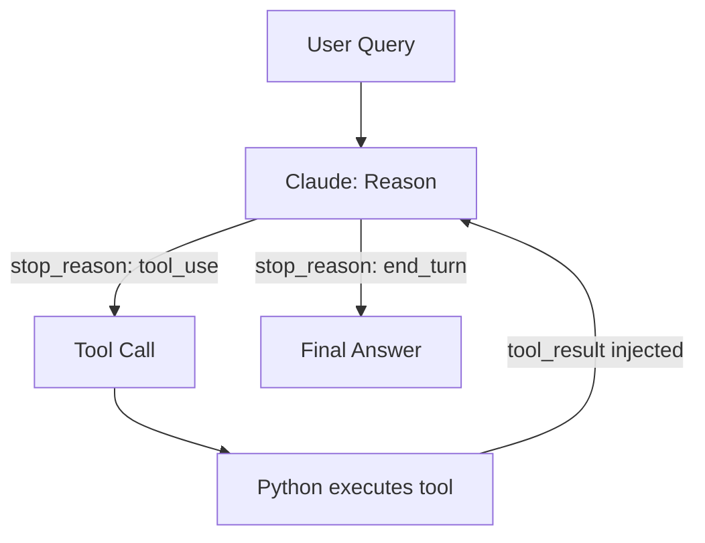

# **Module 5, Lesson 1: The ReAct Pattern — From RAG to Agents**

RAG retrieves information passively. Agents take actions. This lesson introduces the ReAct pattern — the bridge between the two.

---

## Learning Objectives

- **Define** an AI agent and explain how it differs from a RAG pipeline
- **Explain** the Reason → Act → Observe loop
- **Apply** the `stop_reason` API field to implement the agent loop
- **Build** a working multi-tool agent ([code/module5/lesson_agent_loop.py](../../code/module5/lesson_agent_loop.py))

---

## 1. What is an Agent?

A RAG pipeline is a fixed pipeline: query → retrieve → generate → done. An **agent** is a loop: the model decides what to do next, does it, observes the result, then decides again — until the task is complete.

The key difference: **the model controls the flow**, not your code.

```
RAG:    User → [retrieve] → [generate] → Answer   (fixed, 2 steps)
Agent:  User → [reason] → [act] → [observe] → [reason] → ... → Answer  (variable steps)
```

## 2. The ReAct Loop

ReAct stands for **Reason + Act**. The model alternates between:

1. **Reason** — "I need the current weather in Tokyo to answer this question. I'll call `get_weather`."
2. **Act** — Outputs a structured tool call (JSON arguments)
3. **Observe** — Receives the tool result and incorporates it
4. Repeats until it has enough information to give a final answer



## 3. The API Signal: `stop_reason`

The Anthropic API tells you which branch to take via `response.stop_reason`:

| Value | Meaning | Your action |
|---|---|---|
| `"tool_use"` | Model wants to call a tool | Execute the tool, inject result, loop back |
| `"end_turn"` | Model has a final answer | Extract the text and return it |
| `"max_tokens"` | Output was truncated | Increase `max_tokens` or handle gracefully |

## 4. Safety: Always Set MAX_TURNS

An agent loop without a turn limit can run forever if the model gets confused or a tool keeps returning errors. Always cap the loop:

```python
MAX_TURNS = 10
turn = 0
while turn < MAX_TURNS:
    turn += 1
    # ... agent logic
```

---

## Key Takeaways

- Agents differ from RAG by letting the model control the execution flow
- ReAct = Reason (decide what to do) + Act (call a tool) + Observe (read result)
- `stop_reason == "tool_use"` means loop; `stop_reason == "end_turn"` means return
- Always set a MAX_TURNS safety limit

---

## Hands-On Task

Run the agent:

```bash
python code/module5/lesson_agent_loop.py
```

Then:

1. Add a 4th tool `lookup_order(order_id: str)` that returns simulated order status
2. Ask the agent: "What's the status of order #12345 and how much is it in euros if it costs $49.99?" — it should use both `lookup_order` and `calculator`
3. Remove the `MAX_TURNS` limit and ask a deliberately unanswerable question. What happens?

---

*Next: [Lesson 2 — Designing and Integrating Tools](Lesson2_Designing_and_Integrating_Tools.md)*
