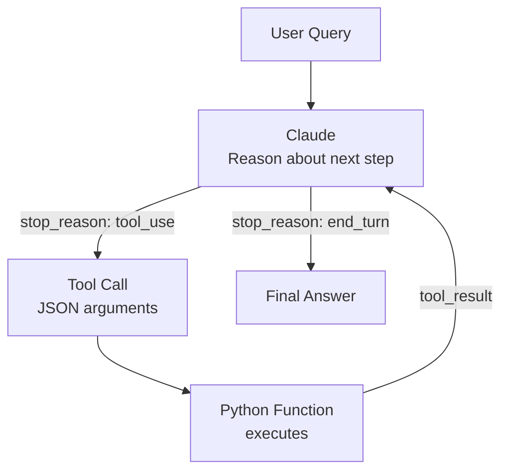

# **Module 5, Lesson 2: Designing and Integrating Tools**

Building on the ReAct pattern from Lesson 1, this lesson dives deep into designing high-quality tool definitions — the JSON Schema specifications that tell Claude what tools are available and how to call them.

---

## Learning Objectives

- **Define** a complete JSON Schema tool specification with correct types, descriptions, and required fields
- **Explain** how Claude decides which tool to call and when
- **Build** a multi-tool agent with a working ReAct loop ([code/module5/lesson_agent_loop.py](../../code/module5/lesson_agent_loop.py))
- **Apply** the five rules of good tool design

---

## 1. The Agent Loop (ReAct Pattern)



Claude alternates between **Reason** (deciding what to do) and **Act** (calling a tool), then **Observes** the result. This loop continues until Claude has enough information to give a final answer.

The `stop_reason` field in the API response tells you which branch to take:
- `"tool_use"` → execute the requested tool and loop back
- `"end_turn"` → return Claude's text as the final answer

---

## 2. Anatomy of a Tool Definition

```python
{
    "name": "search_products",          # Snake_case function name
    "description": "...",               # When and why Claude should use this tool
    "input_schema": {
        "type": "object",
        "properties": {
            "query": {
                "type": "string",       # JSON type: string, number, boolean, array, object
                "description": "...",   # What this parameter means + format hint
            },
            "category": {
                "type": "string",
                "enum": ["a", "b"],     # Restricts valid values (prevents guessing)
            },
            "on_sale_only": {
                "type": "boolean",
                "description": "...",
            }
        },
        "required": ["query"]           # Only list truly mandatory parameters
    }
}
```

---

## 3. Five Rules of Good Tool Design

### Rule 1 — Write the description for Claude, not for humans

Claude uses the `description` field to decide *when* to call the tool. Be explicit:

```python
# BAD — too vague
"description": "Search products"

# GOOD — tells Claude exactly when to use it
"description": (
    "Searches the ACME product catalogue by keyword. "
    "Use when the user asks about products, prices, or availability."
)
```

### Rule 2 — Use `enum` for fixed-value parameters

Without `enum`, Claude might pass `"Electronics"` instead of `"electronics"` — causing a runtime error.

```python
"category": {
    "type": "string",
    "enum": ["electronics", "apparel", "home_goods"]
}
```

### Rule 3 — Only put truly mandatory params in `required`

If a parameter is optional, don't put it in `required`. Claude will try to fill in optional parameters even when it doesn't have the information.

### Rule 4 — Describe the format, not just the meaning

```python
# BAD
"description": "The date"

# GOOD
"description": "The target date in ISO 8601 format, e.g. '2025-01-31'"
```

### Rule 5 — One tool, one clear purpose

Don't create a `do_everything(action, data)` tool. Separate concerns into distinct tools with clear names.

---

## 4. Multi-tool Orchestration

Claude can call multiple tools in a single response (parallel tool use) or chain them across turns. The key principle: **Claude decides the order, not you**.

Your job is to:
1. Define the tools clearly
2. Execute whatever Claude requests
3. Return the results
4. Let Claude synthesise the final answer

---

## Key Takeaways

- The `description` field is the most important part of any tool definition
- Use `enum` for any parameter with a fixed set of valid values
- Never put optional parameters in `required`
- The agent loop runs until `stop_reason == "end_turn"`
- Claude decides which tools to call and in what order

---

## Hands-On Task

Write a complete JSON Schema tool definition for:

```python
def get_employee(
    employee_id: str,
    include_salary: bool = False,
    fields: list[str] | None = None
) -> dict:
    """Returns an employee record from the HR system."""
    ...
```

Requirements:
- `employee_id` is required; the others are optional
- `fields` should describe what valid field names look like
- The description should tell Claude exactly when to use this tool

See the answer key: [solutions/module5/solution_tool_definition.py](../../solutions/module5/solution_tool_definition.py)

---

*Next: [Lesson 3 — Multi-Agent Systems](Lesson3_Multi_Agent.md)*
