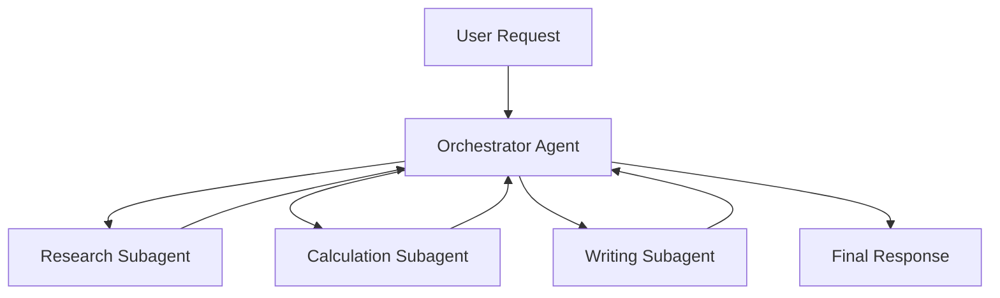

# **Module 5, Lesson 3: Multi-Agent Systems**

Single agents handle sequential tasks well. Some problems — parallel research, quality checking, specialised expertise — are better decomposed across multiple agents working together.

---

## Learning Objectives

- **Define** the orchestrator-subagent pattern
- **Explain** when multi-agent architectures are justified over a single agent
- **Apply** agent handoffs and result aggregation

---

## 1. When to Use Multiple Agents

A single agent handles one task at a time in sequence. Multiple agents are worth the added complexity when:

- **Parallelism matters** — researching 5 topics simultaneously instead of sequentially
- **Specialisation helps** — a "retrieval agent" optimised for search + a "writing agent" optimised for synthesis
- **Quality gates are needed** — a "critic agent" reviews the primary agent's output before it reaches the user
- **Context isolation is required** — each sub-task is large enough to need its own context window

## 2. The Orchestrator-Subagent Pattern



The **orchestrator** breaks the task into sub-tasks, dispatches them, collects results, and synthesises the final answer. Sub-agents are specialised and stateless — they receive a task, complete it, and return a result.

## 3. Implementing Agent Handoffs

The simplest handoff: treat one agent's output as another agent's input.

```python
# Step 1: Research agent finds facts
research_result = run_agent(
    query=f"Find 3 key facts about: {user_topic}",
    tools=[web_search_tool]
)

# Step 2: Writing agent uses those facts
final_response = run_agent(
    query=f"Write a summary using these facts:\n{research_result}",
    tools=[]   # Writer needs no tools — just the facts
)
```

## 4. Failure Modes and Guards

Multi-agent systems amplify failures. An error in a subagent propagates to the orchestrator. Mitigations:

- Validate subagent outputs before passing them on
- Set timeouts per subagent
- Have the orchestrator retry failed sub-tasks with a different approach
- Log every agent turn for debugging

---

## Key Takeaways

- Multi-agent adds complexity — only use it when parallelism, specialisation, or isolation are genuinely needed
- The orchestrator-subagent pattern keeps each agent focused on one concern
- Agent outputs must be validated before being passed as inputs to other agents
- The Final Project's research assistant can be extended into a multi-agent system

---

## Hands-On Task

Extend `final_project/research_assistant.py` into a two-agent system:

1. **Research agent** — retrieves RAG chunks and calls `web_search`, returns raw findings
2. **Synthesis agent** — receives the findings and formats a polished cited response

Compare the quality of the two-agent output vs the single-agent output on the same query.

---

*You've completed Module 5! Next: [Module 6 — Evaluation, Testing & Security](../Module6/Lesson1_Evaluation.md)*
